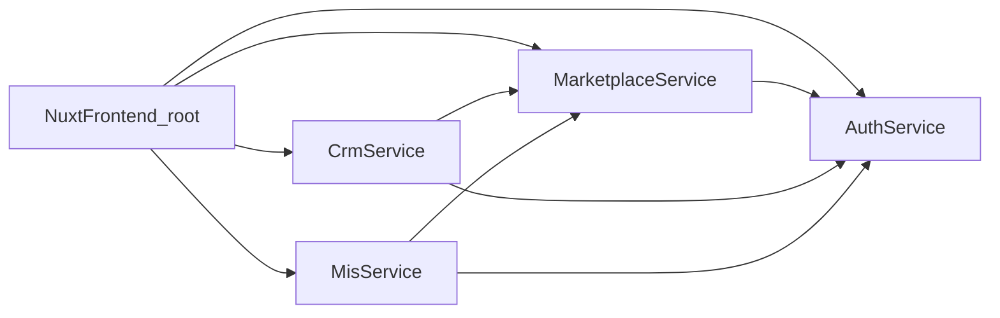

# Целевая архитектура

## Цель

Построить `adm_superApp` для медучреждений как монорепозиторий, в котором:

- **один общий клиент** — каталог [`frontend/`](../frontend/) на `Nuxt + Nuxt UI + Tailwind`
- **несколько backend-микросервисов** — каждый в своей папке (`auth/`, `marketplace/`, `crm/`, `mis/`, …) с собственным `Go + Gin` API, **`db/`** и при необходимости своим `docker-compose`

Текущий сервис `auth/` остаётся отправной точкой по стеку; внутри него пока есть `auth/frontend` как playground — **целевое состояние**: весь UI переносится/дублируется в корневой `frontend/`, а в папках микросервисов фронтенд не ведём.

## Архитектурные принципы

- **единый `frontend/`** в корне репозитория — все маршруты и кабинеты (marketplace, CRM, MIS, auth-страницы) в одном Nuxt-приложении
- **отдельная папка на каждый backend-микросервис** — только HTTP API и данные этого домена
- **одинаковый каркас микросервиса** — `backend/` + `db/` + `docker-compose.yml` (при необходимости) + Dockerfile бэкенда
- независимые базы данных и миграции на уровне сервиса
- `auth` как единый центр identity, session management и RBAC
- клиент ходит в нужный сервис по **разным base URL** (`NUXT_PUBLIC_*_API_BASE`); опционально позже — reverse proxy / API gateway с единым origin
- интеграция между сервисами через HTTP API и явные контрактные DTO
- Docker-first локальная разработка и окружения staging/production
- backup и restore как обязательная часть каждого backend-сервиса

## Целевая структура репозитория

```text
frontend/                 # единое Nuxt-приложение adm_superApp
auth/                     # микросервис: только backend (+ db по плану рефакторинга)
marketplace/
crm/
mis/
shared/                   # опционально: OpenAPI, контракты, CI-шаблоны
Plan/
```

Допустимо добавить `shared/` для общих контрактов, OpenAPI-схем, инфраструктурных шаблонов. Бизнес-логику между сервисами туда не выносим.

## Шаблон микросервиса (backend + db)

Каждый доменный сервис **без вложенного `frontend/`**:

```text
service-name/
  backend/
    cmd/
      main.go
    internal/
    go.mod
    go.sum
    Dockerfile
    Makefile
    .env.example
  db/
    migrations/
    seeds/
    backup/
      cmd/
        main.go
      Dockerfile
    README.md
  docker-compose.yml      # опционально: backend + postgres сервиса
  README.md
  docs/
```

## Единый корневой `frontend/`

```text
frontend/
  app/
    pages/
    components/
    composables/
  nuxt.config.ts
  package.json
  Dockerfile
  .env.example
```

### Обязанности

- маршруты для marketplace, CRM, MIS, логина/аккаунта
- **несколько API-баз**: например `authApiBase`, `marketplaceApiBase`, `crmApiBase`, `misApiBase` через `runtimeConfig.public`
- общие composables: `useAuthSession`, `useMarketplaceApi`, и т.д.
- CORS на каждом бэкенде должен разрешать origin фронта (локально `http://localhost:<порт_фронта>`)

### Почему не `service/frontend` в каждой папке

- один дизайн-системный слой (Nuxt UI, тема, i18n)
- один билд и один деплой фронта при желании
- проще навигация между разделами без cross-origin cookie-ловушек (при разнесённых доменах настраивается явно)
- микросервисы остаются тонкими HTTP API без дублирования UI-скелета

## Назначение основных частей

### `service-name/backend/`

Содержит HTTP API, бизнес-логику, конфигурацию и интеграцию с БД сервиса.

Рекомендуемый layout:

- `cmd/main.go` или `cmd/server/main.go`
- `internal/http` — router, handlers, middleware
- `internal/service` или доменные пакеты
- `internal/repository`
- `internal/config`
- `internal/shared`

### `service-name/db/`

Миграции, seed, backup-утилита, README по схеме.

## Карта сервисов

### `auth`

Зона ответственности:

- логин и регистрация
- OAuth providers
- access token и refresh session
- пользователи и внешние identities
- роли и permissions
- выдача профиля текущего пользователя

`auth` не хранит бизнес-данные клиник, расписаний, сделок и медкарт.

### `marketplace`

Каталог, расписание, слоты, запись, перенос и отмена.

### `crm`

Лиды, воронка, задачи, коммуникации.

### `mis`

Карточка пациента, приёмы, документы, клиническая история.

## Взаимодействие: единый фронт и микросервисы



Базовые правила:

- пользователь аутентифицируется через `auth` (Bearer + refresh cookie на домене `auth` или общая cookie-политика при прокси)
- доменные сервисы валидируют JWT (общий секрет или JWKS / introspection — зафиксировать в cross-cutting)
- каждый сервис объявляет свой порт и URL; фронт знает их из env

## Модель окружений

**Микросервис:**

- `docker-compose.yml` при необходимости
- `backend/.env.example`
- healthcheck
- миграции и seed

**Корневой `frontend/`:**

- `frontend/.env.example` со всеми `NUXT_PUBLIC_*_API_BASE`
- при локальной разработке — dev-server фронта + несколько портов бэкендов

Окружения: `local`, `staging`, `production`.

## Подход к базам данных

- одна основная PostgreSQL database на сервис (или schema на сервис)
- миграции и seed принадлежат сервису
- backup отдельно по каждому сервису

## Роль `auth` в новой архитектуре

Текущий `auth` — modular monolith с готовым RBAC. Для `adm_superApp` нужно расширить multi-organization доступ; структуру папок можно привести к шаблону `auth/backend` + `auth/db` без изменения доменной сути.

## Этапы внедрения архитектуры

1. зафиксировать шаблон микросервиса и корневой `frontend/`
2. согласовать `runtimeConfig` и CORS для всех API
3. привести `auth` к целевому layout (поэтапно), UI перенести в `frontend/`
4. создать `marketplace` как первый продуктовый микросервис
5. подключить `crm`, затем `mis`

## Ключевые решения

- backend: `Go + Gin + pgx + migrate`
- единый frontend: `Nuxt + Nuxt UI + Tailwind` в [`frontend/`](../frontend/)
- БД: `PostgreSQL` в контейнере (на сервис)
- контейнеризация: `Docker + docker-compose` по сервисам + отдельно образ фронта при необходимости
- документация: markdown в `Plan/` и `docs/` у сервисов
