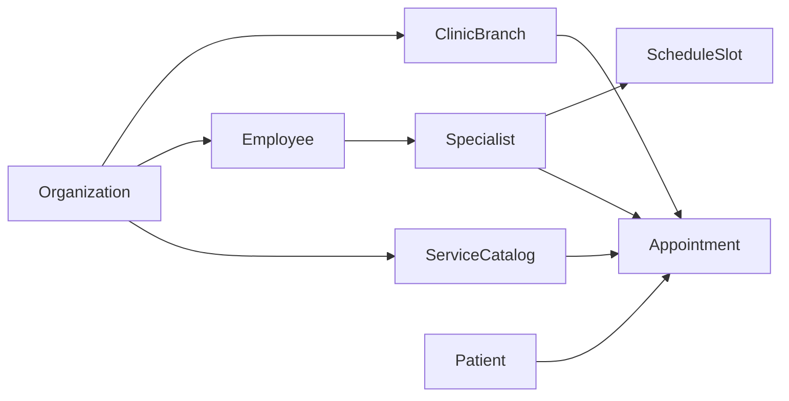

# Общий доменный foundation

## Зачем нужен foundation

`marketplace`, `crm` и `mis` используют одни и те же бизнес-сущности: организации, филиалы, сотрудники, специалисты, пациенты, услуги и записи. Если не зафиксировать общий foundation заранее, сервисы быстро начнут расходиться по идентификаторам, статусам и логике доступа.

Текущий `auth` решает задачи identity и RBAC, но его схема пока покрывает только пользователей, роли, permissions и сессии. Для `adm_superApp` нужен дополнительный доменный слой над этим ядром.

## Базовые доменные сущности

### `organization`

Юридическое лицо или сеть клиник.

Хранит:

- имя и бренд
- тип организации
- статус активности
- timezone по умолчанию
- публичные контакты
- white-label настройки витрины и домена

### `clinic_branch`

Филиал или площадка оказания услуг.

Хранит:

- принадлежность к `organization`
- адрес и географию
- расписание работы
- контактные данные
- список кабинетов и зон обслуживания

### `employee`

Сотрудник организации.

Хранит:

- связь с пользователем из `auth`
- принадлежность к организации и одному или нескольким филиалам
- должность
- служебные контакты
- статус занятости

### `specialist`

Профиль сотрудника, доступный для записи.

Хранит:

- ссылку на `employee`
- специализацию
- список услуг
- длительность приемов
- квалификацию и публичное описание

### `patient`

Клиент или пациент медучреждения.

Хранит:

- ФИО
- ИИН
- дату рождения
- пол
- телефон и email
- предпочтительный канал связи
- согласия на обработку данных

### `service_catalog`

Справочник услуг организации или филиала.

Хранит:

- код услуги
- название
- категорию
- продолжительность
- стоимость
- признаки публичной доступности

### `schedule_slot`

Единица доступности специалиста.

Хранит:

- специалиста
- филиал
- дату и время
- длительность
- статус доступности
- источник формирования слота

### `appointment`

Запись на прием.

Хранит:

- пациента
- специалиста
- услугу
- филиал
- время начала и окончания
- статус записи
- источник создания

### `contact_channel`

Канал связи с пациентом или лидом.

Хранит:

- тип канала
- адрес или идентификатор
- флаг подтверждения
- правила приоритета

### `audit_event`

Событие аудита для административных и клинических действий.

Хранит:

- кто совершил действие
- над какой сущностью
- что изменилось
- когда и из какого источника

## Рекомендуемое распределение ownership

### `auth`

Источник истины для:

- пользователей
- identities
- ролей и permissions
- сессий

### `marketplace`

Источник истины для:

- организации и филиалы на первом этапе
- специалисты
- услуги
- расписание
- записи

### `crm`

Источник истины для:

- лиды
- воронка
- задачи
- коммуникации

`crm` может ссылаться на `patient` и `appointment`, но не должен становиться владельцем расписания.

### `mis`

Источник истины для:

- медицинская карточка пациента
- приемы и документы
- клиническая история

## Связи между сущностями

## Идентификаторы и ссылки

Правила для ID:

- использовать UUID во всех сервисах
- не использовать автоинкремент как публичный идентификатор
- внешние ссылки между сервисами хранить как `*_id`
- для пользовательских справочников добавлять стабильный `code`, если он нужен в API и UI

Минимальный набор кросс-сервисных ссылок:

- `user_id` из `auth` внутри `employee`
- `organization_id` и `clinic_branch_id` в `employee`, `specialist`, `service_catalog`, `schedule_slot`, `appointment`
- `patient_id` в `appointment`, `crm` и `mis`
- `appointment_id` как мост между `marketplace`, `crm` и `mis`

## Multi-organization модель

`adm_superApp` должен с самого начала поддерживать несколько организаций и филиалов. Это означает:

- пользователь может состоять в нескольких организациях
- роли могут быть глобальными и scoped на `organization` или `clinic_branch`
- permission checks должны учитывать не только `code`, но и контекст владения
- единый клиент в корневом [`frontend/`](../frontend/) должен уметь выбирать активную организацию и филиал (контекст в store / route / header к API)

Рекомендуемая модель доступа:

- системные роли: `platform_admin`, `support`
- организационные роли: `clinic_admin`, `registrar`, `doctor`, `operator`
- пациентские роли: `patient`

## Единые статусы и справочники

На foundation-уровне стоит сразу зафиксировать:

- статусы организации
- статусы сотрудника
- статусы пациента
- статусы записи
- типы каналов связи
- типы источников заявки и записи

Даже если часть справочников сначала будет жить прямо в коде, им нужен единый словарь в документации.

## Границы первой итерации

В foundation на первом этапе не обязательно детализировать:

- биллинг и страхование
- лабораторные и стационарные процессы
- сложный документооборот MIS
- интеграции с государственными системами

Но модель должна оставлять место для их добавления без смены базовых ID и связей.

## Что важно учесть до реализации

- `patient` не равен `user`: пациент может существовать без личного кабинета
- `employee` не равен `user`: один пользователь может иметь несколько организационных контекстов
- `specialist` не равен `employee`: не каждый сотрудник доступен для записи
- `appointment` нужна и `marketplace`, и `crm`, и `mis`, поэтому ее жизненный цикл должен быть согласован заранее
- единый `frontend/` может обслуживать разные клиники как white-label клиент: бренд, домен, лендинги и публичные страницы должны настраиваться на уровне организации или клиники, а не хардкодиться в UI
