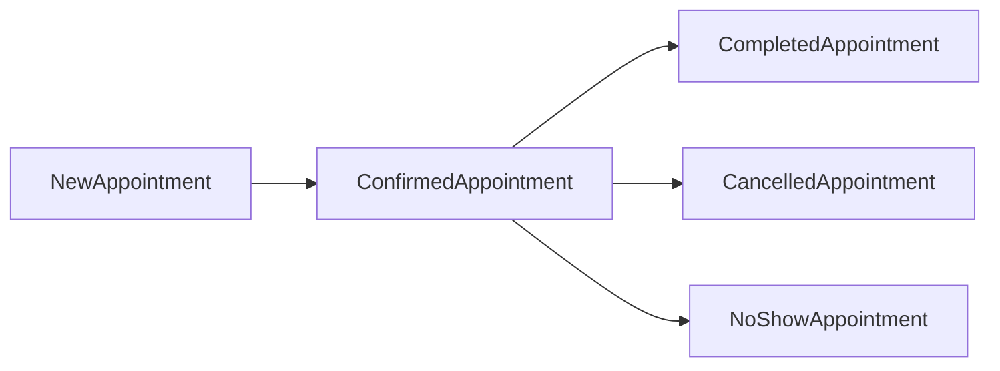

# Marketplace MVP

## Цель MVP

Первый продуктовый модуль `adm_superApp` должен решать главную операционную задачу клиники: быстро и прозрачно записывать пациента к специалисту.

При этом `marketplace` проектируется как B2B-платформа для **сторонних клиник**. Это означает:

- одна backend-платформа обслуживает несколько независимых клиник
- у каждой клиники свой scoped доступ к данным и админке
- публичная витрина должна быть white-label: разный бренд, домен, тексты и визуальная настройка при одном коде `frontend/`
- логика записи должна работать и для неавторизованных пользователей, и для пользователей из `auth`

На первом этапе `marketplace` должен покрыть:

- каталог специалистов
- каталог услуг
- расписание и доступные слоты
- создание записи
- перенос и отмену записи
- базовый кабинет регистратора и администратора клиники

## Что входит в первую версию

### Для пациента

- просмотр списка клиник или филиалов
- просмотр специалистов
- просмотр доступных услуг
- выбор даты и времени
- создание записи
- получение статуса записи
- отдельная страница специалиста
- просмотр графика и свободных окон в стиле `medCalendar`

### Для регистратора

- создание записи от имени пациента
- перенос записи
- отмена записи
- поиск пациента
- просмотр расписания по филиалу и специалисту

### Для врача

- просмотр собственного графика
- просмотр, кто записан и во сколько
- опционально фильтрация по свободным окнам

### Для менеджера call-центра

- создание записи пользователю
- поиск пациента и выбор клиники/специалиста/слота
- просмотр статуса созданных им записей

### Для администратора клиники

- CRUD специалистов
- CRUD услуг
- управление расписанием
- управление доступностью слотов
- доступ только к своей клинике и её филиалам

### Для sales / продажников платформы

- просмотр записей пользователей
- просмотр, кто и куда записан
- возможность записывать пользователя в любую клинику
- подготовка к будущим отзывам, рассылкам и звонкам

## Что не входит в MVP

- клинические записи и медицинские документы
- биллинг, онлайн-оплата и страховые сценарии
- телемедицина и видеоконсультации
- сложные пакеты услуг
- полноценная воронка CRM

## Роли и доступ

Основные роли первой версии:

- `platform_admin`
- `clinic_admin`
- `doctor`
- `call_center_manager`
- `sales_manager`
- `registrar`
- `patient`

Рекомендуемые permission codes:

- `marketplace.branch.read`
- `marketplace.specialist.read`
- `marketplace.specialist.manage`
- `marketplace.service.read`
- `marketplace.service.manage`
- `marketplace.schedule.read`
- `marketplace.schedule.manage`
- `marketplace.appointment.read`
- `marketplace.appointment.create`
- `marketplace.appointment.update`
- `marketplace.appointment.cancel`
- `marketplace.appointment.read_all`
- `marketplace.appointment.create_any_clinic`
- `marketplace.doctor.schedule.read_self`
- `marketplace.doctor.appointment.read_self`
- `marketplace.clinic.settings.manage`
- `marketplace.frontend.manage`

### Scoped access для клиники

Для администратора клиники нельзя давать глобальный доступ ко всей системе. Нужен scoped access по клинике.

С точки зрения backend я рекомендую хранить это как:

- роль `clinic_admin`
- `scope_type = clinic`
- `scope_id = clinic_id`
- опционально `scope_code = clinic_code`

Если бизнесу хочется видеть permission в формате `admin.someClinic`, это лучше делать как **производный alias**, а не как единственный источник истины. Иначе permissions быстро размножатся и станут плохо управляемыми.

Рекомендуемый компромисс:

- в БД и сервисной логике хранить `clinic_admin` + scope
- в UI и audit при необходимости показывать читаемый label вроде `admin.<clinic_code>`

## Основные сущности

### `clinic_branch`

Филиал, доступный для записи.

Минимальные поля:

- `id`
- `organization_id`
- `name`
- `address`
- `phone`
- `timezone`
- `status`

### `specialist`

Специалист, к которому можно записаться.

Минимальные поля:

- `id`
- `organization_id`
- `clinic_branch_id`
- `employee_id`
- `full_name`
- `specialization`
- `description`
- `status`

### `service`

Услуга, доступная для записи.

Минимальные поля:

- `id`
- `organization_id`
- `clinic_branch_id`
- `code`
- `name`
- `duration_minutes`
- `price`
- `is_public`
- `status`

### `clinic_frontend_config`

White-label настройки публичной витрины клиники.

Минимальные поля:

- `id`
- `organization_id`
- `clinic_branch_id` или `NULL` для уровня всей клиники
- `public_slug`
- `domain`
- `theme_config`
- `landing_config`
- `is_public`
- `status`

### `schedule_slot`

Слот расписания специалиста.

Минимальные поля:

- `id`
- `specialist_id`
- `clinic_branch_id`
- `starts_at`
- `ends_at`
- `status`
- `source`

### `appointment`

Запись пациента на услугу.

Минимальные поля:

- `id`
- `organization_id`
- `clinic_branch_id`
- `patient_id`
- `specialist_id`
- `service_id`
- `starts_at`
- `ends_at`
- `status`
- `created_by_user_id`
- `source`
- `patient_iin`
- `patient_name_snapshot`
- `patient_phone_snapshot`

## Статусы записи

На старте достаточно следующего набора:

- `new`
- `confirmed`
- `completed`
- `cancelled_by_patient`
- `cancelled_by_clinic`
- `no_show`

Если нужен более простой запуск, можно начать с `new`, `confirmed`, `cancelled`, `completed`, а затем расширить словарь.

## Жизненный цикл записи

## Backend API

### Публичные или ограниченно-публичные endpoint

- `GET /branches`
- `GET /branches/:id`
- `GET /specialists`
- `GET /specialists/:id`
- `GET /services`
- `GET /availability`
- `POST /appointments`
- `GET /public/clinic`
- `GET /public/clinic/theme`

Эти endpoint могут быть:

- полностью публичными для внешнего каталога
- доступными только после login, если продукт запускается как закрытый B2B-сервис

Публичная запись должна поддерживать 2 сценария:

1. неавторизованный пользователь перед записью заполняет `имя`, `фамилия`, `возраст`, `номер телефона`
2. авторизованный пользователь берется из `auth`; если не хватает обязательных данных, перед записью система дозапрашивает их

Для авторизованного пользователя обязательным бизнес-полем должен стать `ИИН`. Если его нет в профиле, фронтенд перед подтверждением записи должен запросить и сохранить его.

### Защищенные endpoint для сотрудников

- `GET /admin/branches`
- `POST /admin/branches`
- `PATCH /admin/branches/:id`
- `GET /admin/specialists`
- `POST /admin/specialists`
- `PATCH /admin/specialists/:id`
- `GET /admin/services`
- `POST /admin/services`
- `PATCH /admin/services/:id`
- `GET /admin/schedules`
- `POST /admin/schedules`
- `PATCH /admin/schedules/:id`
- `GET /admin/appointments`
- `GET /admin/appointments/:id`
- `PATCH /admin/appointments/:id`
- `POST /admin/appointments/:id/cancel`
- `POST /admin/appointments/:id/reschedule`
- `GET /doctor/me/schedule`
- `GET /doctor/me/appointments`
- `GET /doctor/me/appointments/calendar`
- `GET /call-center/appointments`
- `POST /call-center/appointments`
- `GET /sales/appointments`
- `POST /sales/appointments`

### Защищенные endpoint для пациента

- `GET /me/appointments`
- `GET /me/appointments/:id`
- `POST /me/appointments/:id/cancel`
- `PATCH /me/profile-required-fields`

## Backend-модули сервиса

Рекомендуемая декомпозиция `marketplace/backend/internal`:

- `branch`
- `specialist`
- `servicecatalog`
- `schedule`
- `appointment`
- `patientref`
- `config`
- `http`
- `shared`

`patientref` нужен как тонкий слой ссылок на пациента без переноса всей медицинской логики в `marketplace`.

## Миграции БД

Первая миграция `marketplace` должна создать:

- `organizations`
- `clinic_branches`
- `specialists`
- `services`
- `specialist_services`
- `schedule_slots`
- `clinic_frontend_configs`
- `appointments`
- индексы по времени, филиалу, специалисту и статусу

Опционально на первом этапе:

- `appointment_events`
- `schedule_templates`

## Бизнес-правила

- нельзя создать запись в занятый слот
- длительность записи определяется услугой или переопределением на уровне специалиста
- слот должен принадлежать тому же филиалу, что и специалист
- запись должна быть привязана к организации и филиалу
- отмена и перенос должны сохранять историю изменений
- клиника может создавать запись даже для пациента без личного кабинета
- неавторизованный пользователь до записи обязан заполнить `имя`, `фамилия`, `возраст`, `телефон`
- авторизованный пользователь не вводит уже известные поля повторно
- если у авторизованного пользователя нет обязательных данных, запись блокируется до заполнения недостающих полей
- для авторизованного пользователя обязателен `ИИН`
- администратор клиники не видит записи и настройки других клиник
- врач видит только свое расписание и свои записи
- менеджер call-центра может создавать запись пользователю
- sales-роль может видеть записи по разным клиникам в рамках своего scope
- white-label настройки клиники не должны менять бизнес-логику записи, только публичный вид и контент витрины

## Frontend контур

### Публичные или пациентские экраны

- white-label home клиники
- каталог филиалов
- каталог специалистов
- карточка специалиста
- список услуг
- график специалиста
- выбор слота
- форма создания записи
- список моих записей

### Внутренние экраны клиники

- расписание по филиалу
- расписание по специалисту
- список записей за день
- карточка записи
- формы создания, переноса и отмены
- управление специалистами и услугами
- настройки витрины и темы своей клиники
- кабинет врача с личным расписанием
- кабинет call-центра
- кабинет sales

## Route structure для корневого `frontend/`

UI marketplace живёт в **едином** Nuxt-приложении [`frontend/`](../frontend/), а не в `marketplace/frontend`. Рекомендуемый старт (префикс модуля в URL — на выбор команды, ниже вариант с `/marketplace`):

- `/marketplace` или `/` — платформа / home
- `/:clinicSlug` — white-label витрина клиники
- `/:clinicSlug/specialists`
- `/:clinicSlug/specialists/[id]`
- `/:clinicSlug/booking`
- `/marketplace/branches`
- `/marketplace/specialists`
- `/marketplace/specialists/[id]`
- `/marketplace/booking`
- `/account/appointments` — записи пользователя (данные с `marketplace` API при Bearer из `auth`)
- `/marketplace/admin/schedule`
- `/marketplace/admin/appointments`
- `/marketplace/admin/specialists`
- `/marketplace/admin/services`
- `/marketplace/admin/branding`
- `/marketplace/doctor/schedule`
- `/marketplace/call-center`
- `/marketplace/sales`

HTTP-запросы к данным marketplace идут на **отдельный** base URL микросервиса (например `NUXT_PUBLIC_MARKETPLACE_API_BASE`), а логин и `/me` — на `auth`.

## Интеграция с `auth`

`marketplace` не должен повторно реализовывать логин. Он использует:

- access token из `auth`
- claims пользователя
- permission codes для защиты внутренних endpoint
- профиль пользователя для определения активного контекста

Что потребуется дополнительно:

- mapping пользователя к организациям и филиалам
- роли пациента и сотрудника в организационном scope
- синхронизация `user_id` и профилей сотрудников
- связь пользователя с patient profile и обязательными полями вроде `ИИН`
- резолв клиники по `clinicSlug` или домену для white-label витрины

## MVP delivery plan

### Этап 1

- сервисный каркас `marketplace`
- миграции для филиалов, специалистов, услуг, white-label конфигов и записей
- базовый admin API

### Этап 2

- доступность слотов и алгоритм бронирования
- публичный каталог специалистов
- форма записи
- white-label резолв клиники и публичная витрина
- экраны в корневом [`frontend/`](../frontend/) с вызовами `marketplace` API

### Этап 3

- кабинет регистратора
- кабинет врача
- кабинет call-центра
- кабинет sales
- список моих записей
- отмена и перенос
- админ-разделы в том же [`frontend/`](../frontend/)

### Этап 4

- уведомления о записи
- аудит изменений записи
- подготовка интеграции с CRM

## Критерии готовности MVP

- клиника может завести филиал, специалиста и услугу
- расписание специалиста можно заполнить слотами
- пациент или регистратор может создать запись
- запись нельзя задвоить на один и тот же слот
- сотрудник видит список записей по филиалу и дню
- запись можно перенести или отменить с сохранением статуса

## Детальные планы реализации по слоям

Пошаговые планы вынесены отдельно:

- backend: [`Marketplace/backend/implementation-plan.md`](Marketplace/backend/implementation-plan.md)
- frontend: [`Marketplace/frontend/implementation-plan.md`](Marketplace/frontend/implementation-plan.md)
- индекс `Marketplace`: [`Marketplace/README.md`](Marketplace/README.md)
